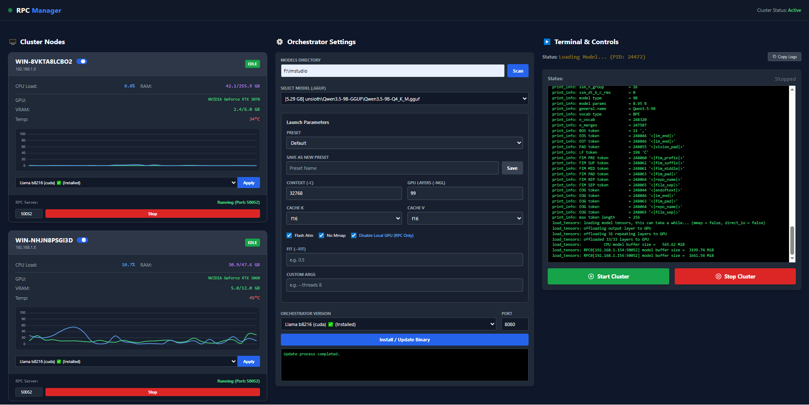

<div align="center">

# 🚀 RPC Manager for llama.cpp Cluster

### Powerful Web UI for managing distributed **llama.cpp RPC GPU clusters**

Run **massive LLM models** across multiple machines by pooling VRAM over your local network.

<p align="center">

<a href="https://www.python.org/">

</a>

<a href="https://flask.palletsprojects.com/">

</a>

<a href="https://tailwindcss.com/">

</a>

<a href="LICENSE">

</a>

<a href="https://github.com/arseniy0924/rpc_manager/stargazers">

</a>

<a href="https://github.com/arseniy0924/rpc_manager/releases">

</a>

</p>

<p align="center">

<a href="#overview">Overview</a> • <a href="#features">Features</a> • <a href="#architecture">Architecture</a> • <a href="#quick-start">Quick Start</a> • <a href="#dashboard">Dashboard</a> • <a href="#building">Build</a> • <a href="#tech-stack">Tech Stack</a>

</p>

</div>

---

# 📖 Overview

**RPC Manager** is a lightweight orchestration platform designed to manage distributed **llama.cpp RPC nodes**.

It allows multiple machines to combine their **GPU VRAM and compute power**, enabling you to run **large language models that would normally exceed a single GPU's capacity**.

The system automatically discovers nodes, deploys binaries, monitors hardware, and launches cluster inference — all from a clean web interface.

This turns your local machines into a **personal AI compute cluster**.

---

# ✨ Features

### ⚡ Zero-Config Cluster Discovery

Uses **mDNS / Zeroconf** to automatically discover nodes on the local network.

No IP configuration required.

---

### 📦 Automatic llama.cpp Deployment

Download and deploy `llama.cpp` builds directly from **GitHub releases**.

Supports:

* CUDA builds
* dependency downloads (DLLs)
* remote installation on nodes

---

### 📊 Real-Time Hardware Telemetry

Monitor all nodes in real time:

• CPU usage
• system RAM
• GPU temperature
• GPU VRAM usage

Powered by `psutil` and `pynvml`.

---

### 🧠 Smart Cluster Launch

Enable or disable nodes in the UI.

The orchestrator automatically builds the correct **RPC endpoint configuration** and launches the cluster.

---

### 💾 Model & Preset Management

Quickly manage your models:

* scan directories for `.gguf`
* store launch presets
* switch models instantly

---

### 🚀 Portable Deployment

Both components can be compiled into **standalone executables**.

✔ No Python installation required
✔ Easy deployment across machines

---

# 🖼 Dashboard

Below is the main control panel of **RPC Manager**.

It provides full control over your distributed `llama.cpp` cluster:

* monitor node hardware in real time
* deploy binaries
* manage models
* configure launch parameters
* control cluster execution

<p align="center">



</p>

---

## What you see in the dashboard

### 🖥 Cluster Nodes

Each connected node displays:

* CPU usage
* system RAM usage
* GPU model
* GPU VRAM usage
* GPU temperature
* live usage graphs
* RPC server status

You can also:

* deploy `llama.cpp` builds
* start / stop RPC servers
* manage individual nodes

---

### ⚙ Orchestrator Settings

Central configuration panel where you can:

* choose `.gguf` models
* scan model directories
* configure context size
* configure GPU layers
* enable Flash Attention
* configure KV cache types
* save reusable presets

---

### 📟 Terminal & Controls

A live terminal showing the `llama.cpp` runtime logs.

From here you can:

* monitor model loading
* debug RPC connections
* see layer distribution across GPUs
* start or stop the entire cluster


# 🏗 Architecture

The system consists of two applications.

```
                +---------------------+
                |   RPC Server        |
                |   (Orchestrator)    |
                |                     |
                |  Flask Web UI      |
                |  Cluster Control   |
                +----------+---------+
                           |
                           |
                     RPC / WebSocket
                           |
        +------------------+------------------+
        |                  |                  |
+---------------+   +---------------+   +---------------+
| RPC Agent     |   | RPC Agent     |   | RPC Agent     |
| Worker Node   |   | Worker Node   |   | Worker Node   |
| GPU Machine   |   | GPU Machine   |   | GPU Machine   |
+---------------+   +---------------+   +---------------+
```

---

## RPC Server (Orchestrator)

Runs on the **main machine**.

Responsibilities:

* cluster orchestration
* Web UI
* launching llama.cpp
* node management
* model selection

---

## RPC Agent (Client)

Runs on **worker machines**.

Responsibilities:

* telemetry reporting
* downloading binaries
* running RPC server
* responding to orchestration commands

---

# 🚀 Quick Start

The easiest way to get started is using **precompiled binaries**.

---

## 1️⃣ Setup the Orchestrator

Download:

```
RPC_Server.exe
```

from

```
[GitHub Releases](https://github.com/arseniy0924/rpc_manager/releases)
```

Run it:

```
RPC_Server.exe
```

Open your browser:

```
http://localhost:5000
```

---

## 2️⃣ Setup Worker Nodes

On every worker PC:

Download:

```
RPC_Agent.exe
```

Run it.

The node will automatically appear in the dashboard.

---

## 3️⃣ Deploy llama.cpp

In the Web UI:

1. Select a `llama.cpp` build
2. Click **Apply**
3. Set your **models directory**
4. Click **Scan**
5. Choose a model
6. Press **Start Cluster**

---

# 🧪 Development Mode

Run directly from Python.

---

## Start Server

```
python server/app.py
```

---

## Start Agent

```
python client/main.py
```

---

# 🏗 Building Executables

The project uses **PyInstaller**.

---

## Build Server

```
pyinstaller --clean --noconfirm --onefile --console --name "RPC_Server" \
--paths . \
--hidden-import "server" \
--collect-all "server" \
--collect-all "zeroconf" \
--collect-all "engineio" \
--collect-all "socketio" \
--collect-data "certifi" \
--add-data "server/templates;server/templates" \
--add-data "server/static;server/static" \
server/app.py
```

---

## Build Agent

```
pyinstaller --noconfirm --onefile --console --name "RPC_Agent" \
--collect-all "zeroconf" \
client/main.py
```

---

# 💻 Tech Stack

### Backend

* Python
* Flask
* Flask-SocketIO

### Frontend

* HTML5
* Vanilla JavaScript
* TailwindCSS
* Chart.js

### Networking

* Zeroconf (mDNS)
* WebSockets

### Hardware Monitoring

* psutil
* pynvml

### Packaging

* PyInstaller

---

# 🤝 Contributing

Contributions are welcome.

If you want to improve the project:

1. Fork the repository
2. Create a feature branch
3. Submit a pull request

You can also open an **issue** for bugs or feature requests.

---

# 📝 License

This project is licensed under the **MIT License**.

See the `LICENSE` file for details.

---

# ⭐ Support the Project

If you find this project useful:

⭐ Star the repository
🐛 Report issues
💡 Suggest improvements
